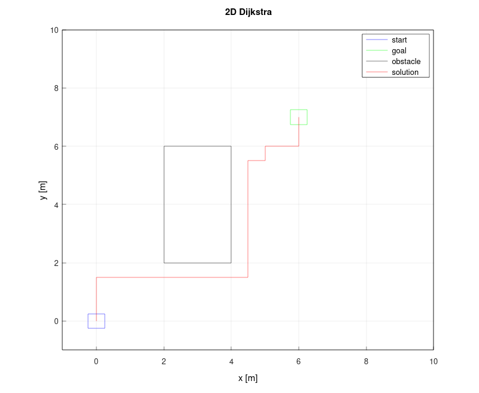
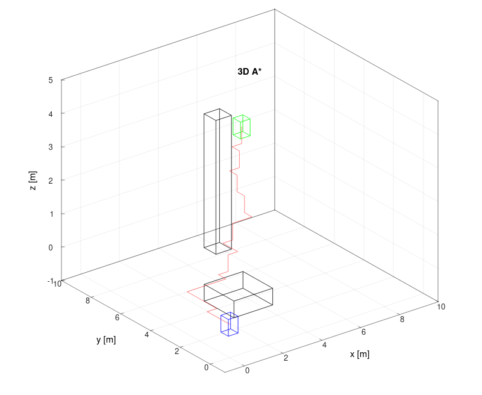
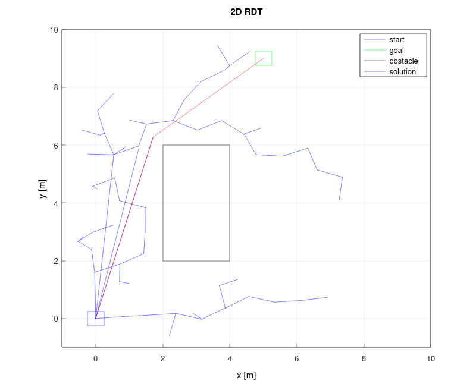
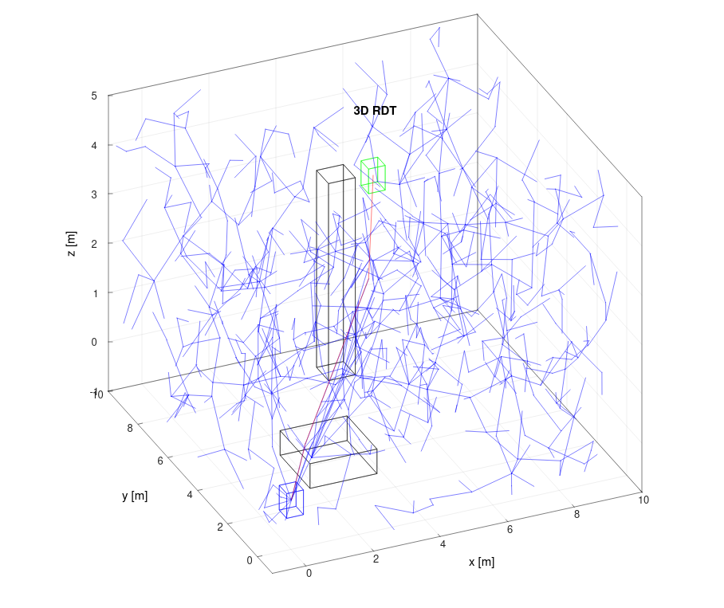

# &xi; - Planning Algorithms

A small C++ template library for planning algorithms. It is not meant to be the most efficient one but to offer a simple and easy to understand implementation of the most common planning algorithms.

## Algorithms
- 2D Dijkstra / A*
- 3D Dijkstra / A*
- 2D RDT*
- 3D RDT*

## Dependencies
- [Eigen](https://eigen.tuxfamily.org/index.php?title=Main_Page), a powerful C++ template library for linear algebra;
- [Matplotplusplus](https://github.com/alandefreitas/matplotplusplus), a simple to use plotting library for C++.

## Installation
Simply clone the repository into your project folder and add the following lines to your CMakeLists.txt:
```cmake
add_subdirectory(xi-planning_algorithms)
target_link_libraries(${PROJECT_NAME} xi-planning_algorithms)
```

## References
- [Planning Algorithms](https://lavalle.pl/planning/), by Steven M. LaValle;
- [Real Time Collision Detection](https://realtimecollisiondetection.net), by Christer Ericson;
- [RRT*-SMART: A Rapid Convergence Implementation of RRT*](https://journals.sagepub.com/doi/10.5772/56718) by Nasir J, Islam F, Malik U, et al.

## License  
This project is licensed under the MIT License.

## Examples
The examples folder contains a few examples on how to use the library.

- 2D Dijkstra 
- 3D A* 
- 2D RDT* 
- 3D RDT* 
